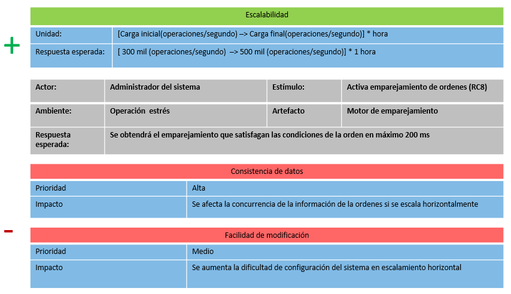

# Arquitectura de Software, Reto 1 (Escalabilidad y Latencia)

Este repositorio contiene el código fuente del experimento realizado con el fin de comprobar 
el punto crítico asociado a la arquitectura de software que se diseñó para el **Reto 1**, reto asociado
a la escalabilidad y latencia de **Tianguix**.

## ASR a satisfacer

A continuación se detalla el ASR que se pretende satisfacer con la arquitectura que se diseñó, con motivo
de dar contexto sobre las motivaciones que nos llevaron a tomar las decisiones de diseño.

## Descripción del experimento

El estilo de arquitectura predominante que dirigió nuestro diseño es de tipo **Publicador-Subscritor**, sin embargo,
para poder satisfacer el ASR descrito anteriormente, decidimos aplicar **Event Sourcing** en nuestro **Motor de Emparejamiento**,
utilizando específicamente el **Modelo de Actores**. Nuestro experimento pretende disipar las dudas y reducir la incertidumbre
asociada al rendimiento del Modelo de Actores en un entorno de alta concurrencia.

## Resultados Esperados

- Tiempos de procesamiento de máximo **100ms** en emparejamiento de órdenes de compra órdenes de venta
- Rendimiento mayor a 300 TPS 

## Tecnologías y frameworks utilizados

- Java 12 como lenguaje de programación
- [Akka](http://https://akka.io/) para la implementación del modelo de actores
- [Predator](https://github.com/Zooz/predator) para la ejecución de las pruebas de carga

Para mayor información sobre la arquitectura diseñada, remitirse a la 
[Wiki](https://github.com/arti4109-arquitectura-de-software/g1-reto1-2020-01-mati-g1/wiki) del experimento