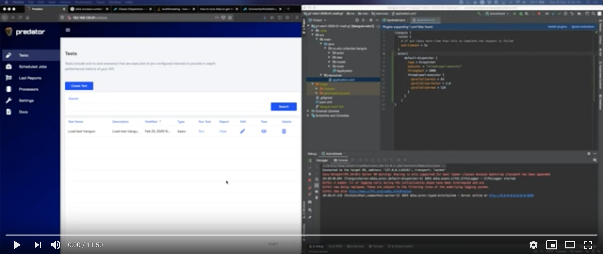

# Arquitectura de Software, Reto 1 (Escalabilidad y Latencia)

Este repositorio contiene el código fuente del experimento realizado con el fin de comprobar 
el punto crítico asociado a la arquitectura de software que se diseñó para el **Reto 1**, reto asociado
a la escalabilidad y latencia de **Tianguix**.

## ASR a satisfacer

A continuación se detalla el ASR que se pretende satisfacer con la arquitectura que se diseñó, con motivo
de dar contexto sobre las motivaciones que nos llevaron a tomar las decisiones de diseño.


## Descripción del experimento

El estilo de arquitectura predominante que dirigió nuestro diseño es de tipo **Publicador-Subscritor**, sin embargo,
para poder satisfacer el ASR descrito anteriormente, decidimos aplicar **Event Sourcing** en nuestro **Motor de Emparejamiento**,
utilizando específicamente el **Modelo de Actores**. Nuestro experimento pretende disipar las dudas y reducir la incertidumbre
asociada al rendimiento del Modelo de Actores en un entorno de alta concurrencia, y de esa manera determinar 
si las decisiones tomadas nos ayudarán a favorecer la escalabilidad asociada al ASR seleccionado.

## Componente a probar

Como se mencionó en el apartado inmediatamente anterior, el experimento gira en torno al **Motor de Emparejamiento**,
cuya composición interna se detalla en el siguiente diagrama de componentes:

.svg "Diagrama de componentes")

## Diseño del experimento

Para facilitar las pruebas sobre el experimento, decidimos simplificar el Motor de Emparejamiento, exponiendo un API de emparejamiento,
pues nuestras dudas asociadas al flujo de eventos proveniente de la cola de mensajería, no suponen una incertidumbre tan grande,
y el exponer un API nos facilita las pruebas de carga, además decidimos no hacer una conección con base de datos, pues preferimos
probar puntualmente el Modelo de Actores, con el fin de determinar si bajo un ambiente de estrés _akka_ seguirá procesando
las ordenes con tiempos de respuesta de no máximo 100 ms, permitiendo pasar de 300.000 TPS a 500.000 TPS, el siguiente
diagrama de componentes describe el diseño asociado al experimento:

.svg "Diagrama de componentes")

## Resultados Esperados

- Tiempos de procesamiento de máximo **100ms** en emparejamiento de órdenes de compra órdenes de venta
- Rendimiento mayor a 300 TPS 

## Evidencia del experimento realizado

La evidencia de la ejecución del experimento se puede ver en el siguiente video:

[](https://youtu.be/rFCCOnK-FDY)

## Tecnologías y frameworks utilizados

- Java 12 como lenguaje de programación
- [Akka](http://https://akka.io/) para la implementación del modelo de actores
- [Predator](https://github.com/Zooz/predator) para la ejecución de las pruebas de carga

## Ejecución de pruebas de carga

La herramienta seleccionada para la ejecución de las pruebas de carga fue Predator (https://www.predator.dev/). 
Para ejecutar las pruebas se debe desplegar el contenedor principal de predator con el siguiente comando:

 ```bash docker run -d -e SQLITE_STORAGE=db/predator -e JOB_PLATFORM=DOCKER -e INTERNAL_ADDRESS=http://$MACHINE_IP:80/v1 -p 80:80 --name predator -v /var/run/docker.sock:/var/run/docker.sock -v $PROJECT_HOME/pruebas_carga/predator:/usr/db zooz/predator```

Donde INTERNAL_ADDRESS es la IP interna de la máquina donde se despliega el contenedor principal de predator, PROJECT_HOME es la ubicación del proyecto.

Para ingresar a la interfaz gráfica se debe seguir el siguiente link: http://localhost/ui, en caso de tener desplegado predator en la máquina local. \ 


**Para mayor información sobre la arquitectura diseñada, remitirse a la 
[Wiki](https://github.com/arti4109-arquitectura-de-software/g1-reto1-2020-01-mati-g1/wiki) del experimento**